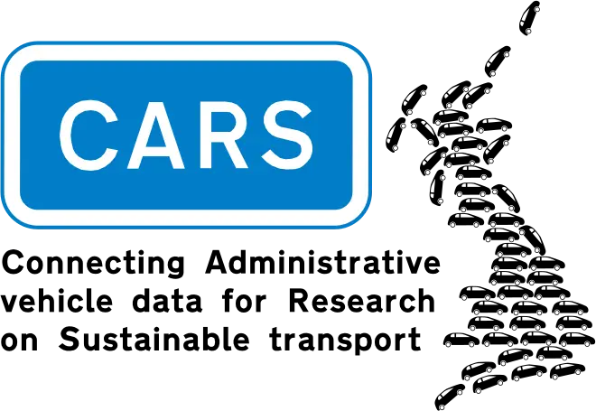

<h1>
    
</h1>

Cars and vans are significant contributors to air pollution and climate change.
This project will enable analysis of issues and trends relating to use of these vehicles at a national, regional and local level. 

The [project team](team.md) will develop and link [data sources](data.md) focused on the usage patterns of all light duty vehicles (under 3.5 tonnes) in Great Britain, to create a single de-identified, research-ready dataset.

In producing this research-ready dataset, the project will create an invaluable resource for researchers to address urgent transport, environmental and social policy questions.
Research using this data will have the potential to inform government action on climate change, air quality and health, road safety and taxation. 

Project timeline: July 2022 – March 2027

- [ADR press release](https://www.adruk.org/news-publications/news-blogs/adr-uk-funds-major-new-data-linkage-projects-to-address-vital-policy-questions/)
- [University of Leeds project page](https://environment.leeds.ac.uk/dir-record/research-projects/1794/cars-connecting-administrative-vehicle-data-for-research-on-sustainable-transport)
